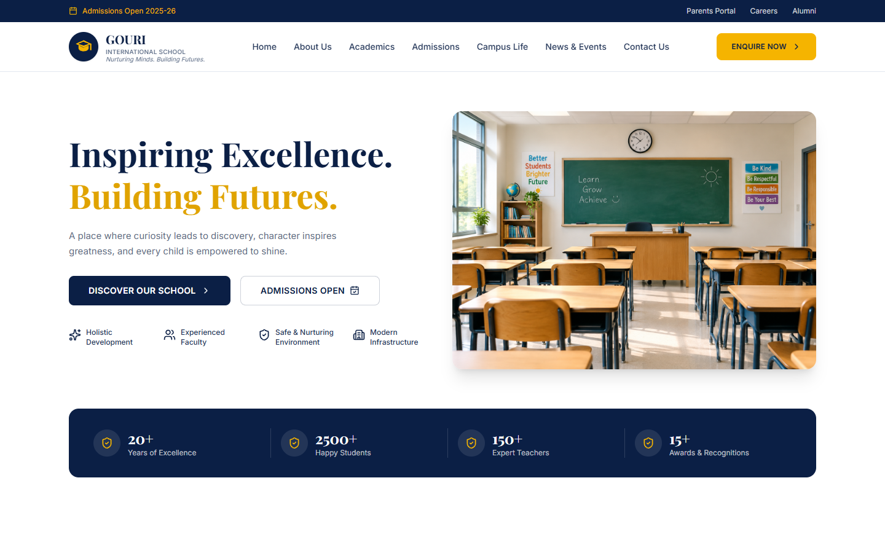

# Gouri International School

A responsive marketing website for Gouri International School, built with React, Vite, Tailwind CSS, and shadcn-style UI components.

**Live site:** [school.codespanda.com](https://school.codespanda.com)



## Sections

- Sticky header with utility bar and mobile navigation
- Hero banner with key stats
- About / "More Than a School" overview
- Academics — program cards for every stage (Early Years to Senior School)
- Campus facilities gallery, including rotating photo tiles for Smart Classrooms and Sports & Playgrounds
- Why parents choose us + testimonials carousel
- News & Events
- Admissions call-to-action
- Footer with contact details and quick links

## Tech stack

- [React 19](https://react.dev/) + [Vite](https://vite.dev/)
- [Tailwind CSS v4](https://tailwindcss.com/)
- [shadcn](https://ui.shadcn.com/)-style UI primitives (`src/components/ui`)
- [lucide-react](https://lucide.dev/) icons

## Getting started

```bash
npm install
npm run dev
```

The dev server runs at `http://localhost:5173`.

## Build

```bash
npm run build
```

Outputs a production build to `dist/`.

## Deploy

The site deploys to GitHub Pages via [`gh-pages`](https://www.npmjs.com/package/gh-pages):

```bash
npm run deploy
```

This builds the project and publishes `dist/` to the `gh-pages` branch. GitHub Pages is configured to serve the custom domain `school.codespanda.com` (see `public/CNAME`).

## Project structure

```
src/
  components/       Page sections (Header, Hero, AboutSection, ...)
  components/ui/    Reusable UI primitives (Button, Card)
  lib/utils.js       cn() helper for class merging
public/
  Images/            School photos used across the site
docs/
  screenshot.png     Homepage screenshot used in this README
```
